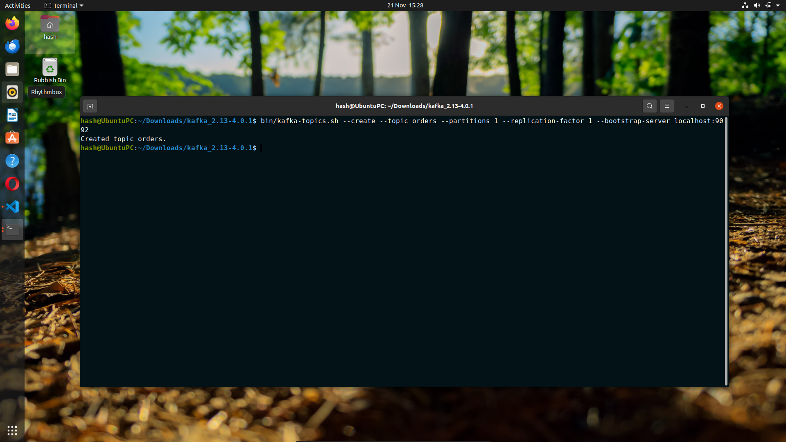
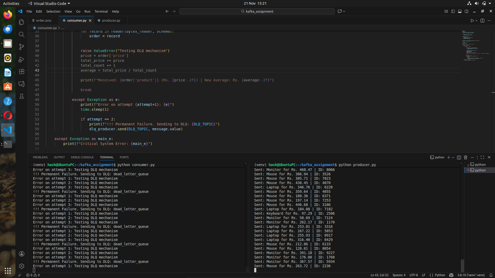

# Kafka-Based Order Processing System with Avro Serialization and Dead Letter Queue Handling

A robust distributed order processing system built with Apache Kafka, featuring Avro serialization for efficient data serialization and a Dead Letter Queue (DLQ) pattern for handling failed messages.

## 📋 Table of Contents
- [Features](#features)
- [Architecture](#architecture)
- [Prerequisites](#prerequisites)
- [Installation](#installation)
- [Project Structure](#project-structure)
- [Usage](#usage)
- [Configuration](#configuration)
- [Avro Schema](#avro-schema)
- [Error Handling](#error-handling)
- [Contributing](#contributing)

## ✨ Features

- **Apache Kafka Integration**: Distributed message streaming for order processing
- **Avro Serialization**: Efficient binary serialization with schema evolution support
- **Dead Letter Queue (DLQ)**: Automatic handling of failed messages for retry or investigation
- **Producer-Consumer Architecture**: Decoupled order submission and processing
- **Schema Registry**: Centralized schema management for data consistency
- **Error Resilience**: Robust error handling with configurable retry mechanisms

## 🏗️ Architecture


The system consists of three main components:

1. **Order Producer**: Generates and publishes order messages to Kafka
2. **Order Consumer**: Processes orders from Kafka topics
3. **DLQ Handler**: Manages failed messages for troubleshooting


## 📦 Prerequisites

- Python 3.8 or higher
- Apache Kafka 2.8+ (running locally or remote)
- Confluent Schema Registry (optional but recommended)
- pip (Python package manager)

## 🚀 Installation

1. **Clone the repository**
```bash
git clone <repository-url>
cd "Kafka-Based Order Processing System with Avro Serialization and Dead Letter Queue Handling"
```

2. **Install dependencies**
```bash
pip install -r requirements.txt
```

3. **Start Kafka and Zookeeper**
```bash
# Start Zookeeper
bin/zookeeper-server-start.sh config/zookeeper.properties

# Start Kafka
bin/kafka-server-start.sh config/server.properties
```

4. **Create required topics**
```bash
# Create orders topic
kafka-topics.sh --create --topic orders --bootstrap-server localhost:9092 --partitions 3 --replication-factor 1

# Create DLQ topic
kafka-topics.sh --create --topic orders-dlq --bootstrap-server localhost:9092 --partitions 1 --replication-factor 1
```


## 🎯 Usage

### Starting the Order Producer

```bash
python producer.py
```

The producer will:
- Generate sample order data
- Serialize orders using Avro schema
- Publish messages to the `orders` topic

### Starting the Order Consumer

```bash
python consumer.py
```

The consumer will:
- Subscribe to the `orders` topic
- Deserialize Avro messages
- Process valid orders
- Send failed messages to DLQ

### Monitoring the Dead Letter Queue

```bash
python dlq_handler.py
```

The DLQ handler will:
- Monitor the `orders-dlq` topic
- Log failed messages for investigation
- Optionally retry processing

## 📸 Screenshots

### Execution Results




## ⚙️ Configuration

### Kafka Configuration

Edit the bootstrap servers and topic names in the respective Python files:

```python
KAFKA_BOOTSTRAP_SERVERS = 'localhost:9092'
ORDERS_TOPIC = 'orders'
DLQ_TOPIC = 'orders-dlq'
```

### Consumer Group

Configure consumer group for parallel processing:

```python
CONSUMER_GROUP = 'order-processing-group'
```

## 📊 Avro Schema

The order schema (`order_schema.avsc`) defines the structure of order messages:

```json
{
  "type": "record",
  "name": "Order",
  "namespace": "com.orders",
  "fields": [
    {"name": "order_id", "type": "string"},
    {"name": "customer_id", "type": "string"},
    {"name": "product_id", "type": "string"},
    {"name": "quantity", "type": "int"},
    {"name": "price", "type": "double"},
    {"name": "timestamp", "type": "long"}
  ]
}
```

## 🔧 Error Handling

### Dead Letter Queue Pattern

Failed messages are automatically routed to the DLQ when:
- Deserialization fails
- Processing exceptions occur
- Validation errors are detected



### Retry Strategy

Configure retry attempts in `consumer.py`:

```python
MAX_RETRIES = 3
RETRY_BACKOFF = 5  # seconds
```

## 🤝 Contributing

Contributions are welcome! Please follow these steps:

1. Fork the repository
2. Create a feature branch (`git checkout -b feature/amazing-feature`)
3. Commit your changes (`git commit -m 'Add amazing feature'`)
4. Push to the branch (`git push origin feature/amazing-feature`)
5. Open a Pull Request

## 📝 License

This project is part of an academic assignment for the Big Data course (8th Semester, Computer Engineering).

## 📧 Contact

For questions or support, please contact the course instructor or teaching assistants.

---


